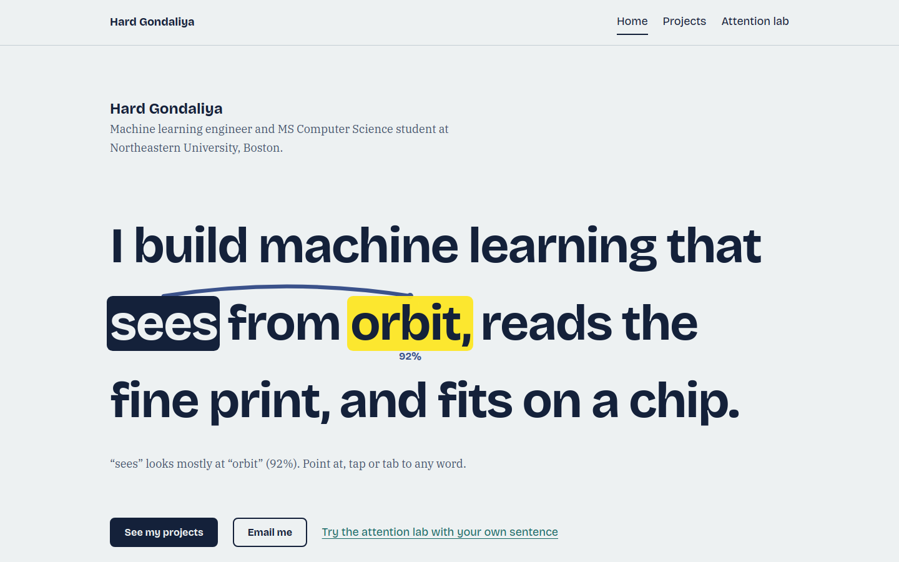

# Hard Gondaliya: personal homepage

The personal homepage of Hard Gondaliya, a machine learning engineer and MS
Computer Science student at Northeastern University. Built with vanilla HTML5,
CSS3 and ES6 modules, with no frameworks or libraries.

- **Live site:** https://hard3007.github.io/
- **Demo video:** _add the link to your narrated video here_
- **Design document:** [docs/design-document.md](docs/design-document.md)
- **Slides ppt:** [https://docs.google.com/presentation/d/1enGYWI5TbWMFGkQjW5wOAijumX6nqJwImx6Pqzk_Lrc/edit?usp=sharing]



## Author

**Hard Gondaliya**
[gondaliya.h@northeastern.edu](mailto:gondaliya.h@northeastern.edu) ·
[LinkedIn](https://www.linkedin.com/in/hard-gondaliya) ·
[GitHub](https://github.com/Hard3007)

## Class

**CS5610 Web Development**, Northeastern University, Fall 2026.
Instructor: John Alexis Guerra Gómez.
Class page: https://johnguerra.co/classes/webDevelopment_online_fall_2026/

## Project objective

Build a personal homepage that a recruiter, an ML engineer or a professor can
understand in under a minute, using only front-end web standards. The site
should:

1. Introduce Hard, his experience, skills, projects and publication, with an
   easy way to get in touch.
2. Include an original component that sets it apart from other homepages.
3. Meet the course requirements: ES6 modules, W3C-valid HTML, ESLint and
   Prettier clean code, organized folders, and public deployment.

### The creative component

The homepage headline, _"I build machine learning that sees from orbit, reads
the fine print, and fits on a chip,"_ is a live self-attention demo. Every word
is a button. Pointing at, tapping or tabbing to a word draws arcs to the words
it attends to, with weights computed in the browser by a softmax over dot
products. The [Attention lab](lab.html) page extends this into a full heatmap
where visitors can type their own sentence, switch between four attention
heads, apply a causal mask and change the temperature.

### Pages

| Page          | File            | Contents                                                            |
| ------------- | --------------- | ------------------------------------------------------------------- |
| Home          | `index.html`    | Interactive headline, about, education, experience, skills, contact |
| Projects      | `projects.html` | Six projects with a filter saved in the URL, plus a publication     |
| Attention lab | `lab.html`      | **AI-generated page.** Interactive attention heatmap                |

## Instructions to build

You need [Node.js](https://nodejs.org/) 18 or later.

```bash
# 1. Get the code
git clone https://github.com/Hard3007/Hard3007.github.io.git
cd Hard3007.github.io

# 2. Install the dev tools (ESLint, Prettier, a local server)
npm install

# 3. Run it locally. Opens http://localhost:8080
npm start

# 4. Check and format the code
npm run lint
npm run format
```

The pages use ES6 modules, which browsers won't load from `file://`. Always
open the site through `npm start` or another local server, not by
double-clicking the HTML file.

### Deploying to GitHub Pages

1. Push the code to a repository named `Hard3007.github.io`.
2. In the repository, open **Settings → Pages**.
3. Under **Build and deployment**, choose **Deploy from a branch**, then select
   `main` and `/ (root)`.
4. The site will be live at https://hard3007.github.io/ in a minute or two.

## Project structure

```text
├── index.html               Home page
├── projects.html            Projects page
├── lab.html                 Attention lab (AI-generated page)
├── css/
│   ├── style.css            Design tokens, layout and shared components
│   └── lab.css              Lab page styles
├── js/
│   ├── main.js              Shared: mobile menu, footer year
│   ├── modules/
│   │   ├── attention.js     Self-attention math (no libraries)
│   │   ├── colormap.js      Viridis colormap and accessible text colors
│   │   └── hero-attention.js  Interactive headline component
│   └── pages/
│       ├── home.js          Entry point for index.html
│       ├── projects.js      Project filter
│       └── lab.js           Heatmap playground
├── images/                  Favicon and project illustrations (SVG)
├── fonts/                   Self-hosted fonts and their licenses
├── files/                   Résumé PDF
├── docs/                    Design document, mockups, screenshots
├── eslint.config.js
├── package.json
└── LICENSE
```

## How this project meets the rubric

| Requirement                              | Where                                                                                                                     |
| ---------------------------------------- | ------------------------------------------------------------------------------------------------------------------------- |
| Design document                          | [docs/design-document.md](docs/design-document.md): description, 4 personas, 6 user stories, wireframes and final mockups |
| Meaningful homepage                      | Education, 4 internships, 6 projects, skills, publication, contact                                                        |
| ES6 modules                              | `"type": "module"` in `package.json`; every page uses `<script type="module">`                                            |
| Original component                       | Interactive attention headline and the Attention lab                                                                      |
| Organized folders                        | `css/`, `js/`, `images/`, `fonts/`, `files/`, `docs/`                                                                     |
| Meta author, description, icon           | In the `<head>` of every page                                                                                             |
| Original JS over 5 lines                 | `js/modules/attention.js`, `hero-attention.js`, `js/pages/lab.js`, `projects.js`                                          |
| Two pages plus a third AI-generated page | `index.html`, `projects.html`, and `lab.html` (AI-generated)                                                              |
| Classes for identifying elements         | Scripts select by class (`.hero-sentence`, `.filter-button`, `.heatmap`)                                                  |
| Standard tags                            | Real `<button>`, `<a>`, `<form>`, `<fieldset>` and `<table>`, never clickable `div`s                                      |
| CSS without `!important`                 | `css/style.css`, `css/lab.css`                                                                                            |
| Flexbox and grid                         | Flexbox for header, nav and filters; CSS grid for sections, projects and the lab                                          |
| MIT license                              | [LICENSE](LICENSE)                                                                                                        |


**What the AI generated:**

- All three HTML pages, with the content taken from my résumé.
- Both stylesheets, including the color palette and typography choices.
- All JavaScript modules: the attention math, the interactive headline, the
  project filter and the lab page.
- The six project illustrations and the favicon, drawn by a Python script it
  wrote.
- This README, the design document, the wireframes and the screenshots.
- The ESLint and Prettier configs and `package.json`.

The Attention lab (`lab.html`) is the designated AI-generated page, and it says
so on the page.

## Credits

- Fonts: [Bricolage Grotesque](https://github.com/ateliertriay/bricolage) and
  [IBM Plex Serif](https://github.com/IBM/plex), both under the SIL Open Font
  License. License files are in `fonts/`.
- The viridis colormap was designed by Stéfan van der Walt and Nathaniel Smith
  for Matplotlib.

## License

[MIT](LICENSE) © 2026 Hard Gondaliya
