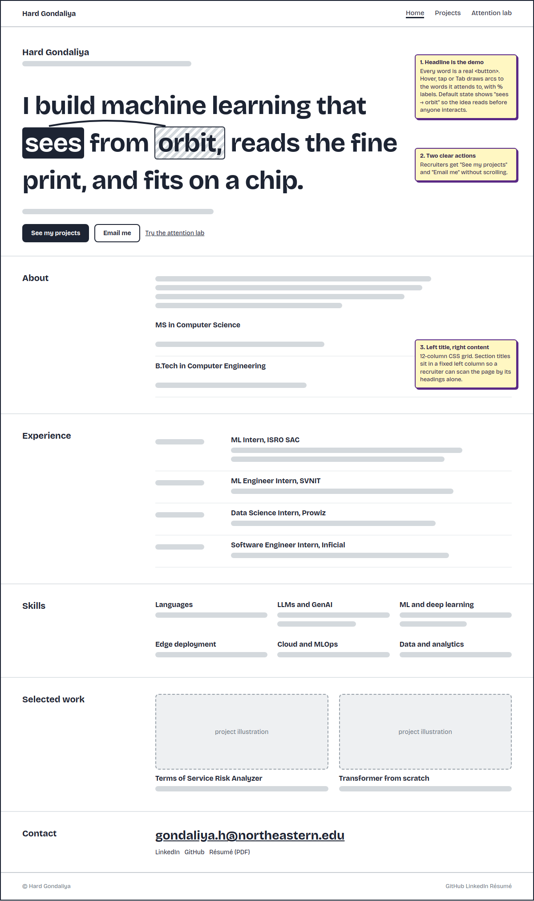
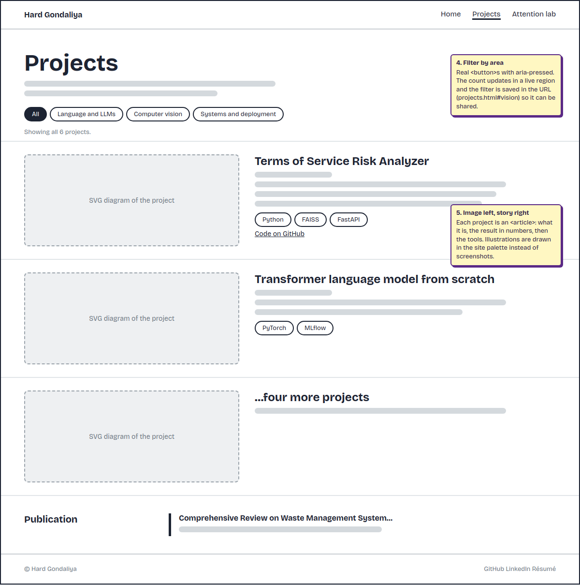
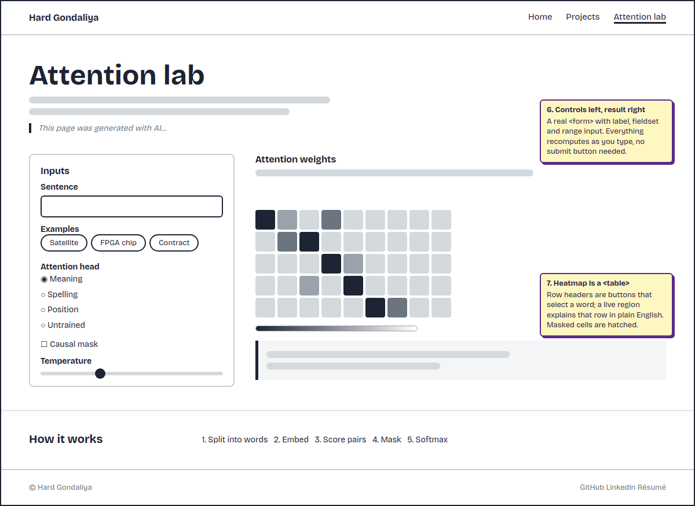
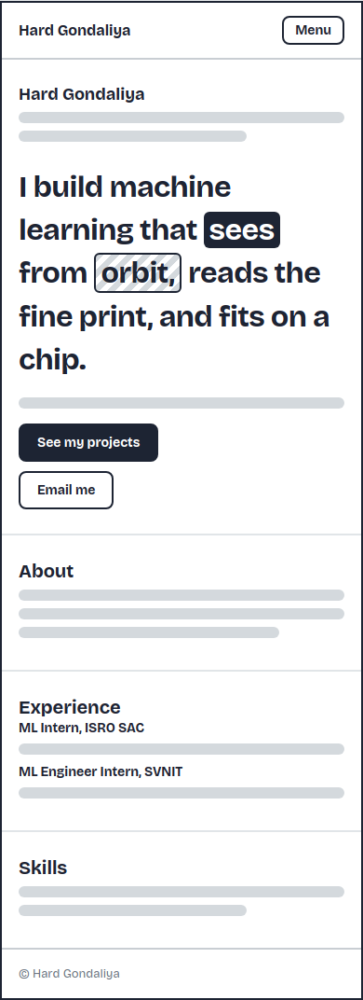
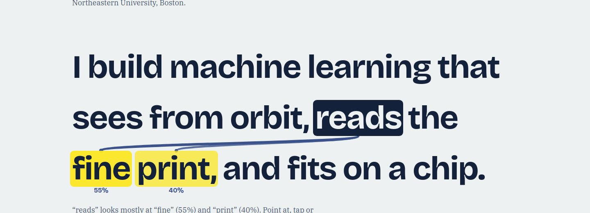
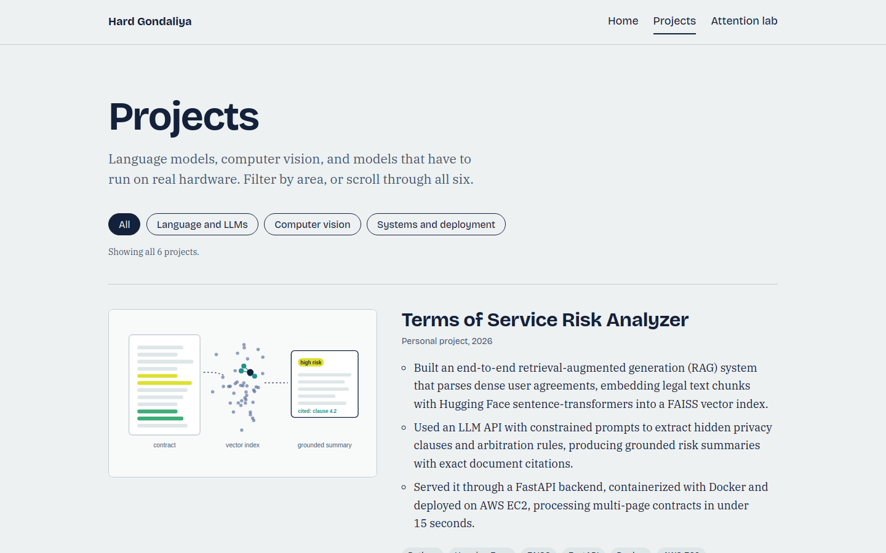
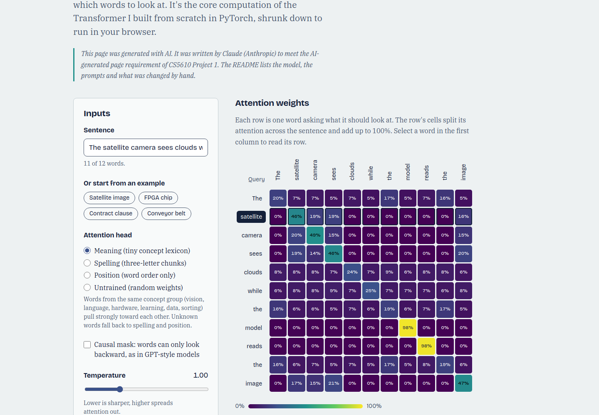
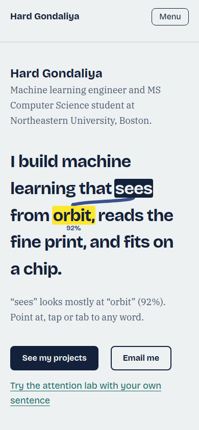

# Design document: Hard Gondaliya's personal homepage

CS5610 Web Development, Project 1. Author: Hard Gondaliya.

## 1. Project description

This project is a personal homepage for Hard Gondaliya, a machine learning
engineer and MS Computer Science student at Northeastern University's Khoury
College in Boston. The site introduces who Hard is, shows his internship
experience and projects, and gives recruiters, engineers and faculty an easy
way to contact him.

Hard's work has a clear theme: machine learning under real constraints. He has
run CNN inference on FPGA hardware for satellite imagery at ISRO, built a RAG
system that finds risky clauses in legal agreements, and implemented a
Transformer from scratch. The homepage is built around that theme instead of a
generic template.

### Goals

1. A recruiter can tell who Hard is, what he does and how to contact him within
   30 seconds, on a phone or a laptop.
2. A technical reader can see evidence of depth: numbers, tools, and a working
   demo of the idea at the center of modern NLP.
3. The site is original. Its signature feature is a headline that is also a
   live self-attention demo.
4. The code meets the course constraints: vanilla HTML5, CSS3 and ES6 modules,
   no frameworks, no jQuery, no backend, W3C valid, and deployed publicly.

### Scope

| Page          | URL             | Purpose                                                                |
| ------------- | --------------- | ---------------------------------------------------------------------- |
| Home          | `index.html`    | Introduction, interactive headline, about, experience, skills, contact |
| Projects      | `projects.html` | Six projects with a filter by area, plus a peer-reviewed publication   |
| Attention lab | `lab.html`      | AI-generated page: an interactive attention heatmap for any sentence   |

Out of scope: a blog, a contact form (it would need a backend), and dark mode.

### Constraints

- Front-end only, hosted as static files on GitHub Pages.
- All JavaScript is written as ES6 modules and loaded with `type="module"`.
- No component libraries or CSS frameworks. Layout uses flexbox and CSS grid.
- Fonts are self-hosted so the site has no third-party requests.

## 2. User personas

### Persona 1: Priya Raman, university recruiter

- **Who:** Technical recruiter at a mid-size AI company, hiring ML interns and
  co-ops. Reviews 40 to 60 candidates a day.
- **Context:** Opens portfolio links from LinkedIn messages and résumés, often
  on her phone between calls.
- **Goals:** Confirm the candidate's school, graduation date, role focus and
  location. Find an email and a résumé quickly.
- **Frustrations:** Portfolios with splash animations, vague taglines, or
  contact details buried in a footer. Pages that break on mobile.
- **What the site gives her:** Name, role and school at the top of the page.
  "Email me" and "See my projects" buttons without scrolling. Dates on every
  role. A downloadable résumé.

### Persona 2: Marcus Chen, senior machine learning engineer

- **Who:** Senior ML engineer and interviewer on a computer vision and edge AI
  team. Screens candidates before technical interviews.
- **Context:** Reads portfolios on a laptop, usually the evening before an
  interview.
- **Goals:** Find evidence the candidate understands the fundamentals, not just
  library calls. Look for measurable results and deployment experience.
- **Frustrations:** Project lists with no numbers, tutorials presented as
  projects, "AI enthusiast" copy with nothing behind it.
- **What the site gives him:** Concrete results (30+ FPS, 98% accuracy after
  quantization, 5.30 perplexity), a filter for deployment work, and an
  attention demo he can poke at to see if the candidate really understands it.

### Persona 3: Dr. Elena Ruiz, faculty member

- **Who:** Assistant professor at Northeastern running a small NLP lab, looking
  for a research assistant.
- **Context:** Received Hard's email and clicks through from his signature.
- **Goals:** See research experience, publications and relevant coursework.
- **Frustrations:** Having to dig through a résumé PDF to find a publication.
- **What the site gives her:** A publication section with venue and volume,
  NLP coursework listed under education, and three language projects one
  click away.

### Persona 4: Sam Okafor, keyboard and screen reader user

- **Who:** Engineering manager who uses a screen reader and navigates with the
  keyboard.
- **Goals:** Move through the page quickly by headings and links, and use the
  interactive parts without a mouse.
- **Frustrations:** Clickable `div`s that can't be focused, demos that only
  work on hover, and focus outlines removed for looks.
- **What the site gives him:** A skip link, real buttons and links, visible
  focus rings, live regions that announce what changed, and a heatmap built as
  a real table with headers.

## 3. User stories

Each story is written as a short scene, followed by the acceptance criteria
used to check it.

### Story 1: Priya screens Hard between calls

_As a recruiter, I want to see who Hard is and how to reach him right away, so
that I can decide in under a minute whether to move him forward._

Priya has four minutes before her next call. She taps the portfolio link in
Hard's LinkedIn message on her phone. The first screen shows his name, "Machine
learning engineer and MS Computer Science student at Northeastern University,
Boston," and a large sentence about satellite imagery, legal text and chips.
She notices one word is highlighted and a line connects it to another word, but
she doesn't need to interact to understand the page. She taps "Email me," her
mail app opens with his address filled in, and she sends a note asking about
his co-op dates.

**Acceptance criteria**

- Name, role and school are visible without scrolling at 390 px wide.
- "Email me" is a `mailto:` link to `gondaliya.h@northeastern.edu`.
- Images have `width` and `height` set, so they don't shift the layout while
  loading.

### Story 2: Priya checks graduation and internship dates

_As a recruiter, I want every role and degree to show dates, so that I can
check co-op eligibility without opening the résumé._

Later, Priya returns on her laptop to fill in the candidate tracker. She
scrolls to "Experience" and reads down the left column: Jan 2025 to May 2025,
May 2024 to Jul 2024, and so on. Under "About" she finds the MS program runs
Sep 2025 to May 2027. She downloads the résumé PDF from the Contact section to
attach to the record.

**Acceptance criteria**

- Every role and degree uses the same date format and a `<time>` element.
- The experience list is newest first.
- The résumé link points to a PDF in the `files/` folder.

### Story 3: Marcus tests whether Hard understands attention

_As an interviewer, I want to interact with something Hard built, so that I
can judge his understanding before the interview._

Marcus opens the homepage the night before an interview. He moves his mouse
over "reads" in the headline, and arcs slide toward "fine" (55%) and "print"
(40%). The caption explains the result in plain words. Curious, he follows the
link to the Attention lab, types "quantize the model so it fits on the FPGA,"
switches to the "Position" head and turns on the causal mask. The upper
triangle of the heatmap turns hatched and each row still adds up to 100%. He
writes a note to ask Hard how multi-head attention would combine these heads.

**Acceptance criteria**

- Hovering, tapping or focusing any headline word redraws the arcs and updates
  the caption.
- The lab recomputes on every input change without a submit button.
- With the causal mask on, cells after the query word show no value and are
  hatched.
- Every row of the heatmap sums to 100%, within rounding.

### Story 4: Marcus shares Hard's deployment work with a colleague

_As a hiring manager, I want to filter projects to deployment work and share
that view, so that my teammate sees exactly what I saw._

Marcus's team cares about edge inference. On the Projects page he selects
"Systems and deployment." The list narrows to the FPGA satellite pipeline and
the RAG analyzer served on AWS, and the status line reads "Showing 2 systems
and deployment projects." He copies the URL, which now ends in `#systems`, and
pastes it into a team chat. His colleague opens it and sees the same filtered
view.

**Acceptance criteria**

- Filter controls are `<button>` elements with `aria-pressed`.
- The status line is a live region and updates on every change.
- Loading `projects.html#systems` (or `#vision`, `#language`) restores that
  filter. An unknown hash falls back to "All."

### Story 5: Dr. Ruiz looks for research experience

_As a faculty member, I want to find Hard's publication and NLP work quickly,
so that I can decide whether to invite him to a lab meeting._

Dr. Ruiz clicks the portfolio link in Hard's email signature. On the homepage
she sees Natural Language Processing and Foundations of AI in his coursework.
The "Selected work" section links to the Projects page, where she selects
"Language and LLMs" and reads about the Transformer and DistilBERT projects.
At the bottom she finds his Springer publication with the series, volume and
conference.

**Acceptance criteria**

- Coursework is listed under each degree.
- The publication shows authors, title, series, volume, conference and year.
- The "Language and LLMs" filter shows three projects.

### Story 6: Sam navigates the whole site with the keyboard

_As a screen reader user, I want every interactive feature to work from the
keyboard, so that I get the same experience as everyone else._

Sam presses Tab once and a "Skip to content" link appears. He skips the
navigation and tabs into the headline. Each word is announced as a button, and
the caption below is read aloud as it changes: "'machine' looks mostly at
'learning' (50%)." On the lab page he moves through the form by its labels,
adjusts the temperature slider with the arrow keys, and selects rows of the
heatmap using the word buttons in the first column.

**Acceptance criteria**

- A skip link is the first focusable element on every page.
- Every interactive element is a native `button`, `a`, or form control.
- Focus is always visible (3 px outline in the accent purple).
- Captions and the lab readout use `aria-live="polite"`.
- On small screens the menu button reports `aria-expanded` and closes with
  Escape.

## 4. Information architecture

```text
Home (index.html)
├── Hero: name, role, interactive headline, primary actions
├── About + education
├── Experience timeline
├── Skills
├── Selected work → Projects
└── Contact: email, LinkedIn, GitHub, résumé

Projects (projects.html)
├── Filter: All / Language and LLMs / Computer vision / Systems and deployment
├── Six project articles
└── Publication

Attention lab (lab.html)  [AI-generated page]
├── Inputs: sentence, examples, head, causal mask, temperature
├── Attention heatmap + readout
└── How it works
```

The main navigation (Home, Projects, Attention lab) appears on every page, and
the current page is marked with `aria-current="page"`.

## 5. Design mockups

### Low-fidelity wireframes

The wireframes were made before the visual design. The yellow notes explain
the main decisions.

**Home, desktop**



**Projects, desktop**



**Attention lab, desktop**



**Home, mobile**



### Final design

**Home, desktop.** The default state shows "sees" attending to "orbit."


**Headline interaction.** Hovering "reads" routes arcs through the gap
between lines to "fine" and "print."



**Projects, desktop**



**Attention lab, desktop**



**Home, mobile**



## 6. Visual design

### Direction

The look is a lab notebook: cool paper, navy ink, and one data palette. The
palette for anything that shows model output is **viridis**, the default
colormap in Matplotlib, which most ML practitioners read at a glance. Viridis
colors only appear where data is shown (attention weights, project
illustrations). The rest of the interface stays quiet so the headline can be
the one memorable element.

### Color

| Token            | Hex                                                       | Use                                    |
| ---------------- | --------------------------------------------------------- | -------------------------------------- |
| `--paper`        | `#edf1f2`                                                 | Page background                        |
| `--paper-raised` | `#f8fafa`                                                 | Form panel, readout, image backgrounds |
| `--ink`          | `#14213a`                                                 | Text, primary buttons, selected states |
| `--ink-soft`     | `#46546b`                                                 | Secondary text, dates, captions        |
| `--link`         | `#176a66`                                                 | Links                                  |
| `--focus`        | `#5b2a86`                                                 | Keyboard focus ring                    |
| viridis ramp     | `#440154` → `#3b528b` → `#21918c` → `#5ec962` → `#fde725` | Heatmap, arcs, illustrations           |

Every text color meets WCAG AA (4.5:1) on its background. Ink on paper is
14.1:1, secondary text 6.7:1, links 5.6:1. Heatmap cells pick white, ink or
black text by computing contrast against each cell's color.

### Typography

- **Bricolage Grotesque** (700 and 400) for headings, navigation, buttons and
  data labels. Its tight, slightly quirky shapes give the big headline
  personality.
- **IBM Plex Serif** (400, italic, 700) for body text. A serif body sets long
  descriptions apart from the interface text and suits the research content.
- Scale: 14, 18 (body), 21, 24, 36 and 48 px, with the headline fluid from
  about 34 px on phones to 80 px on large screens.
- Body text is limited to about 65 characters per line, with a 1.65 line
  height.

Both fonts use the SIL Open Font License and are self-hosted in `fonts/`.

### Layout

- A 12-column CSS grid for sections. Titles take the first three columns and
  content takes the rest, so the page can be scanned by headings alone.
- Flexbox for the header, navigation, buttons, filters and footer.
- `auto-fit` grids for skills and featured work, which reflow without extra
  breakpoints.
- Breakpoints at 36, 40, 48, 52 and 56 rem, each where the content breaks, not
  at device sizes.

### Motion

Motion only responds to what the visitor does. Arcs draw in over 420 ms when a
word is selected. There are no scroll-triggered animations. With
`prefers-reduced-motion`, the arcs appear instantly.

## 7. The creative component

The homepage headline, "I build machine learning that sees from orbit, reads
the fine print, and fits on a chip," is a working self-attention demo. Each
phrase maps to part of Hard's experience: satellite imagery at ISRO, the
Terms of Service analyzer, and FPGA deployment.

How it works (`js/modules/attention.js`):

1. The sentence is split into words.
2. Each word gets vectors built in the browser: character trigrams (spelling),
   sinusoidal positional encodings from "Attention Is All You Need" (position),
   and a small lexicon of about 80 ML and engineering words (meaning).
3. Scores are dot products scaled by a temperature, and each row goes through a
   softmax so it sums to 1. An optional causal mask sets future scores to
   negative infinity.
4. `hero-attention.js` draws the result as SVG arcs whose thickness and opacity
   follow the weights. Arcs between words on the same line curve above them;
   arcs between lines travel through the gap so they never cross the text.

It is a teaching toy, not a trained model, and the lab page says so.

## 8. Technical architecture

```text
├── index.html, projects.html, lab.html
├── css/
│   ├── style.css        tokens, base, layout, components, home, projects
│   └── lab.css          lab page only
├── js/
│   ├── main.js          shared: mobile menu, footer year
│   ├── modules/
│   │   ├── attention.js      tokenizer, embeddings, softmax, heads
│   │   ├── colormap.js       viridis interpolation
│   │   └── hero-attention.js homepage headline component
│   └── pages/
│       ├── home.js      entry for index.html
│       ├── projects.js  project filter with URL hash
│       └── lab.js       heatmap playground
├── images/              favicon, project illustrations (SVG)
├── fonts/               self-hosted WOFF fonts + licenses
├── files/               résumé PDF
└── docs/                this document, mockups, screenshots
```

**Progressive enhancement.** Without JavaScript, the headline is plain text,
the caption says what JavaScript would add, all projects are listed, and the
navigation stays visible on mobile. JavaScript adds a `has-js` class before it
collapses the menu.

**Selecting elements.** Scripts find elements by class name
(`.hero-sentence`, `.filter-button`, `.heatmap`). IDs are only used to connect
labels, ARIA attributes and headings.

## 9. Accessibility checklist

- One `h1` per page and a logical heading order.
- Skip link, landmarks (`header`, `nav`, `main`, `footer`) and labelled
  sections.
- Native `button`, `a`, `input`, `fieldset` and `table` elements only.
- Descriptive `alt` text on every image.
- Visible focus on every interactive element.
- Live regions for the headline caption, filter status and lab readout.
- The heatmap has a caption and row and column headers, and it scrolls
  sideways on small screens inside a focusable region.
- Reduced motion is respected.
